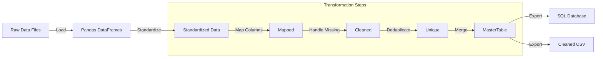
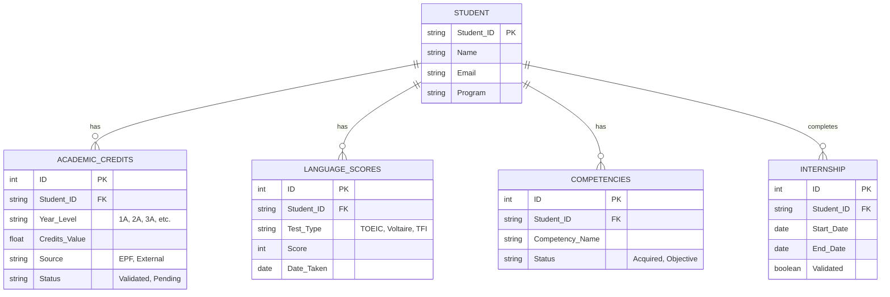

# EPF Diploma Validation System - Design & Layout

## 🏗️ High-Level Architecture

This diagram illustrates the overall structure of the system, from data ingestion to visualization.

```mermaid
graph TD
    subgraph "Data Sources"
        DS_Dip[Diploma Services]
        DS_BDE[BDE / DSI]
        DS_Lang[Language Services]
        DS_Int[International Dev]
        DS_Stud[Director of Studies]
        DS_Intern[Internship Services]
    end

    subgraph "Data Processing (Python/Pandas)"
        Ingest[Data Ingestion Script]
        Clean[Data Cleaning & Normalization]
        Valid[Validation Rules Engine]
    end

    subgraph "Storage"
        DB[(Central SQL Database)]
        DD[Data Dictionary]
    end

    subgraph "Presentation"
        Dash[Dashboard (Power BI / Web)]
        Rep[Reports]
    end

    DS_Dip -->|Excel / Phenix| Ingest
    DS_BDE -->|TBD| Ingest
    DS_Lang -->|Scores| Ingest
    DS_Int -->|VEIO / TFI| Ingest
    DS_Stud -->|Voltaire| Ingest
    DS_Intern -->|PFE Dates| Ingest

    Ingest --> Clean
    Clean --> Valid
    Valid --> DB
    DD -.->|Defines| DB
    DB --> Dash
    DB --> Rep
```

## 🔄 Data Flow Diagram

This diagram details how data moves through the system and how it is transformed.



## 🗃️ Entity Relationship Diagram (Draft)

A tentative schema for the central database based on the data sources.



## 📝 Data Dictionary Structure

| Field Name | Data Type | Description | Source | Validation Rule |
|------------|-----------|-------------|--------|-----------------|
| `Student_ID` | String | Unique identifier (e.g., EPF2024-123) | All | Must be unique |
| `Credits_Total` | Float | Sum of validated credits | Phenix/Excel | >= 180 for diploma |
| `English_Score` | Integer | TOEIC or equivalent score | Langues | >= 785 |
| `PFE_Validated` | Boolean | Internship validation status | Stages | True if valid |
