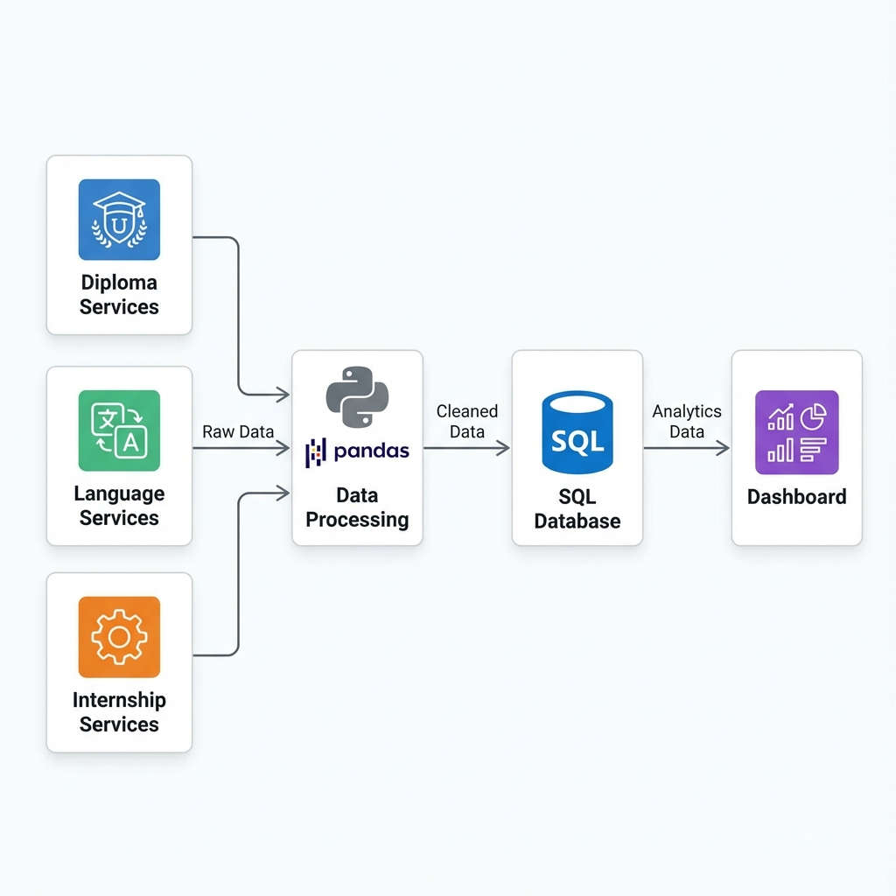
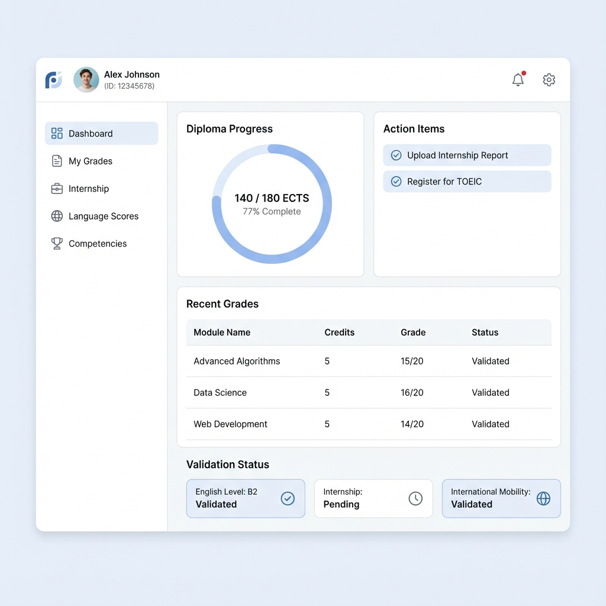

# MVP Demo Walkthrough

## How to Run the Demo

1.  **Navigate to the demo folder**:
    ```bash
    cd "d:\EPF COURSE\Engineering Project\codebase\demo-v0.1"
    ```

2.  **Install Dependencies**:
    ```bash
    pip install -r requirements.txt
    ```

3.  **Run the Streamlit App**:
    ```bash
    streamlit run app.py
    ```

## Visual Assets

### Data Flow Diagram


### Student Dashboard Mockup


### Admin Dashboard Mockup


## Features

-   **Dashboard Overview**: High-level metrics and global progress.
-   **Student Details**: Individual student profiles with validation status and credit progress.
-   **Data Sources**: Status of data integration.
